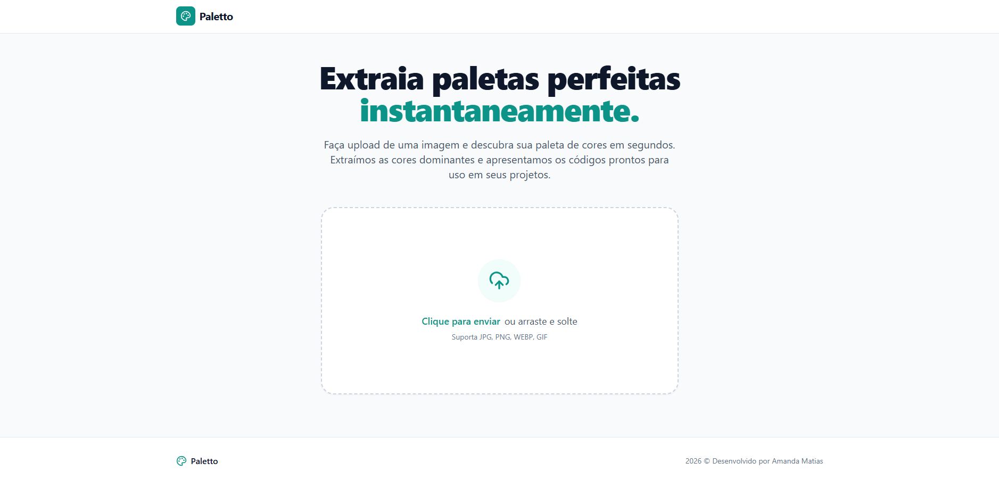
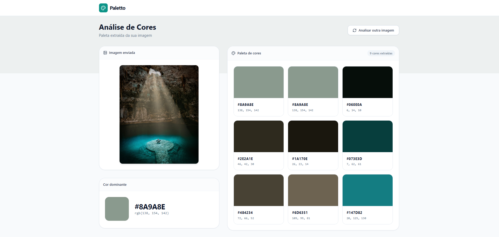

# 🎨 Palette

Palette é uma aplicação Full Stack que analisa imagens e extrai automaticamente sua paleta de cores dominantes, retornando os códigos HEX e RGB de cada cor identificada.


### Tela inicial


### Análise de cores



## 🚀 Funcionalidades

- Upload de imagem via clique ou arrastar e soltar
- Extração da cor dominante da imagem
- Geração de paleta com até 8 cores
- Exibição dos códigos HEX e RGB de cada cor
- Cópia do código HEX com um clique

 


## 🛠️ Tecnologias

### Backend
- Java 17
- Spring Boot 3
- Maven
- Algoritmo K-Means implementado em Java puro

### Frontend
- React + TypeScript
- Tailwind CSS
- Vite


## 🏗️ Arquitetura do Backend
```
paletteBack/
└── src/main/java/com/palette/
    ├── controller   → recebe as requisições HTTP
    ├── service      → lógica de negócio e processamento de imagem
    ├── dto
    │   └── response → objetos de resposta da API
    ├── exception    → tratamento global de erros
    └── config       → configurações de CORS
```

---

Desenvolvido por **Amanda Matias**
